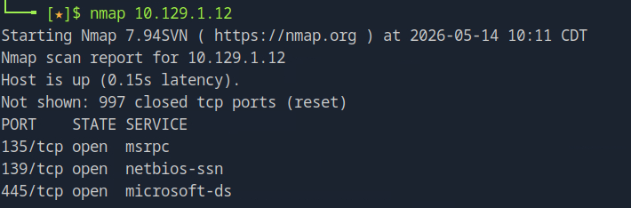
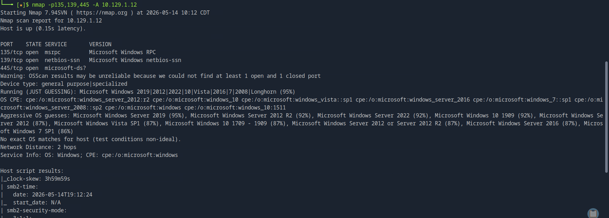
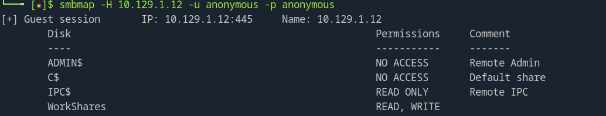
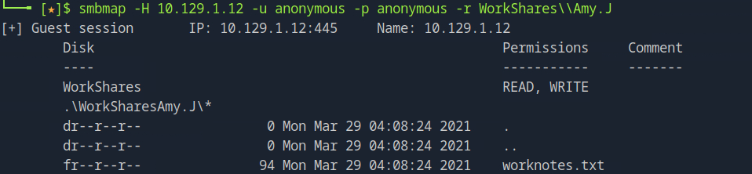
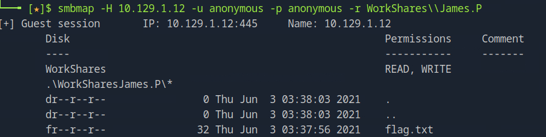
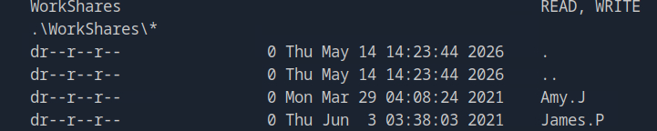

# Hack The Box Starting Point: Dancing Walkthrough

## Introduction
This document details the penetration testing methodology used to compromise the "Dancing" machine on Hack The Box's Starting Point. This scenario focuses on enumerating and exploiting misconfigured Windows file sharing services, specifically targeting Server Message Block (SMB).

## Theoretical Background: What is SMB?
**Server Message Block (SMB)** is a client-server communication protocol used for sharing access to files, printers, serial ports, and other resources on a network. It is predominantly used in Windows environments, though it is also implemented in Linux/Unix environments via Samba.

### Key Concepts of SMB
* **Ports Used:** Modern SMB implementations run directly over TCP on **Port 445**. Older versions (NetBIOS over TCP/IP) utilized ports 137, 138, and 139.
* **Authentication and Authorization:** Access to SMB shares typically requires valid user credentials. However, misconfigurations often allow **null sessions** or **anonymous logins**, meaning a user can access shares without a valid username or password.
* **Security Implications for Career Development:** SMB has historically been a significant attack vector (e.g., the EternalBlue exploit used by WannaCry ransomware). As a cybersecurity professional, understanding how to securely configure SMB (disabling SMBv1, requiring message signing, enforcing strict access controls, and disabling anonymous access) is crucial for hardening enterprise environments.

---

## 1. Reconnaissance and Enumeration

### Initial Nmap Scan
As standard practice, we begin with network reconnaissance using `nmap` to discover open ports.



The initial scan identifies **Port 445** as open, which immediately points to an active SMB service running on the target.

### Aggressive Service Enumeration
We follow up with an aggressive scan (`-A` or `-sC -sV`) targeted at the open ports to retrieve banner information, service versions, and run default vulnerability scripts.



The scan confirms the operating system is likely Windows and provides further details about the SMB service configuration. The presence of port 445 makes SMB our primary attack vector.

---

## 2. Exploitation and Access

To interact with the SMB service, we utilize **smbmap**, a powerful command-line tool that allows users to enumerate samba share drives across an entire domain.

### Enumerating Shares
First, we attempt to list the available shares using anonymous credentials (`-u anonymous -p anonymous`). The `-r` flag is used to recursively list the contents of the shares.

```bash
smbmap -H <TARGET_IP> -u anonymous -p anonymous -r
```



The output reveals several default Windows shares (like `IPC$`), but more importantly, a custom share named `WorkShares` that we have READ access to.

### Exploring the 'WorkShares' Directory
We narrow our focus to the `WorkShares` directory to see what files are accessible.

```bash
smbmap -H <TARGET_IP> -u anonymous -p anonymous -r WorkShares
```



Inside `WorkShares`, we discover two user directories: `Amy.J` and `James.P`.

### Finding the Flag in James.P
We continue our enumeration by investigating the `James.P` directory. Note the use of double backslashes (`\\`) to properly escape the path in the terminal.

```bash
smbmap -H <TARGET_IP> -u anonymous -p anonymous -r WorkShares\\James.P
```


Within the `James.P` directory, we locate a file named `flag.txt`.

---

## 3. Retrieving the Flag

With the exact path to the flag identified, we can proceed to download the file to our local machine. This can be achieved by using `smbmap`'s download feature or by connecting interactively using `smbclient`.




By successfully downloading `flag.txt`, we complete the objective of this machine.

## Conclusion
The Dancing machine highlights a common and severe misconfiguration in corporate environments: allowing anonymous read access to sensitive SMB shares. Attackers routinely scan for open SMB ports and attempt null/anonymous sessions to map out internal file structures, often finding credentials, backups, or proprietary data. Securing SMB by enforcing authenticated access is a fundamental step in network defense.
