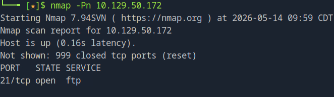
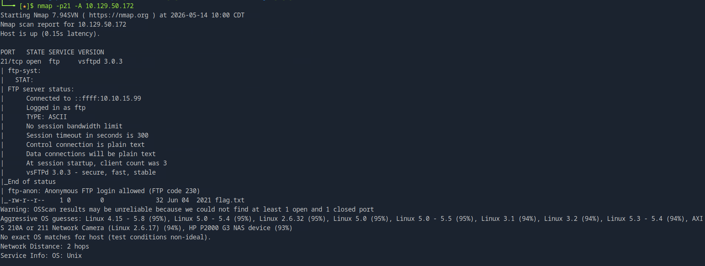
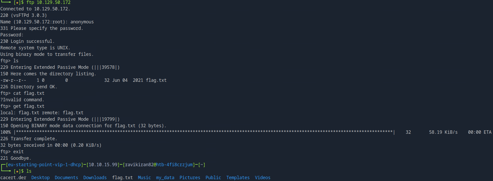

# Hack The Box Starting Point: Fawn Walkthrough

## Introduction
This document outlines the penetration testing methodology applied to the "Fawn" machine from Hack The Box's Starting Point. The objective of this lab is to understand basic network reconnaissance and the exploitation of misconfigured file transfer services.

## Theoretical Background: What is FTP?
**File Transfer Protocol (FTP)** is a standard network protocol used for the transfer of computer files between a client and server on a computer network. Built on a client-server model architecture, FTP operates on two primary communication channels between the client and server:
1. **Command Channel (Port 21):** Used for transmitting control information, such as user identification (login credentials) and commands (e.g., listing directories).
2. **Data Channel (Port 20 or random high ports depending on Active/Passive mode):** Used for the actual transfer of file data.

### Key Concepts of FTP
* **Cleartext Transmission:** Traditionally, FTP transmits data, including credentials, in plain text, making it vulnerable to packet sniffing. For secure transfers, modern systems use FTPS (FTP over SSL/TLS) or SFTP (SSH File Transfer Protocol).
* **Anonymous Login:** Many public FTP servers are configured to allow "anonymous" access. This means a user can log in with the username `anonymous` and typically any password (or a blank one) to access public files. If this feature is enabled on an internal or restricted server by mistake, it leads to a serious security vulnerability.

---

## 1. Reconnaissance and Enumeration

### Initial Nmap Scan
The first step in any penetration test is to discover open ports and services running on the target. We utilize `nmap` (Network Mapper) for this task.



The initial scan reveals that **Port 21** is open. Based on standard port assignments, this indicates that an FTP service is running on the target machine.

### Aggressive Service Enumeration
To gather more context about the FTP service, an aggressive `nmap` scan (`-A` or `-sC -sV`) was executed. This command probes the open ports with default scripts to identify service versions, operating system details, and potential misconfigurations.



**Findings:** The script output explicitly states: `ftp-anon: Anonymous FTP login allowed (FTP code 230)`. This is a critical finding, indicating that we do not need valid user credentials to access the FTP share.

---

## 2. Exploitation and Access

With the knowledge that anonymous login is permitted, we can attempt to connect to the target's FTP service using a standard FTP client.

### Connecting via FTP
We initiate the connection by executing:
```bash
ftp <TARGET_IP>
```

When prompted for the username, we enter `anonymous`. For the password, we can simply press `Enter` to submit a blank password.



### Navigating and Retrieving the Flag
Once successfully logged in (indicated by a `230 Login successful` response code), we are dropped into the FTP command prompt. 
1. We use the `ls` command to list the contents of the current directory.
2. We identify a file named `flag.txt`.
3. To download the file to our local machine, we use the `get` command:
   ```bash
   get flag.txt
   ```
4. The file transfer is successful, yielding the root flag for this machine.

## Conclusion
The Fawn machine demonstrates the importance of proper access control on network services. The misconfiguration of allowing anonymous FTP access allowed us to easily retrieve sensitive files without any authentication. In a real-world scenario, FTP servers should have anonymous login disabled unless explicitly intended for public file distribution, and secure alternatives like SFTP should be prioritized.
